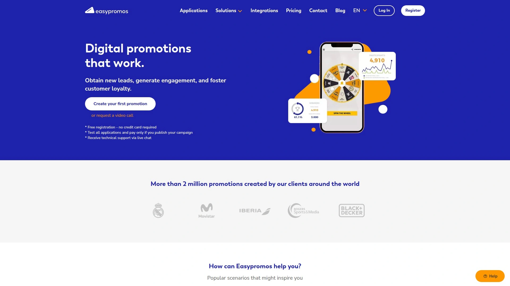
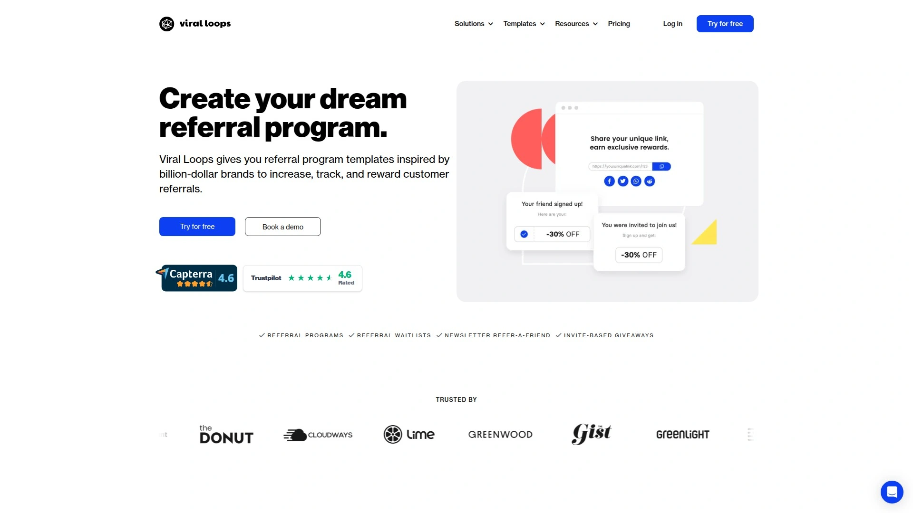
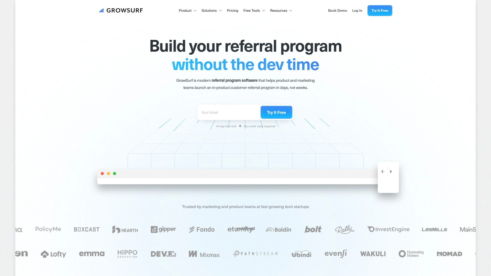
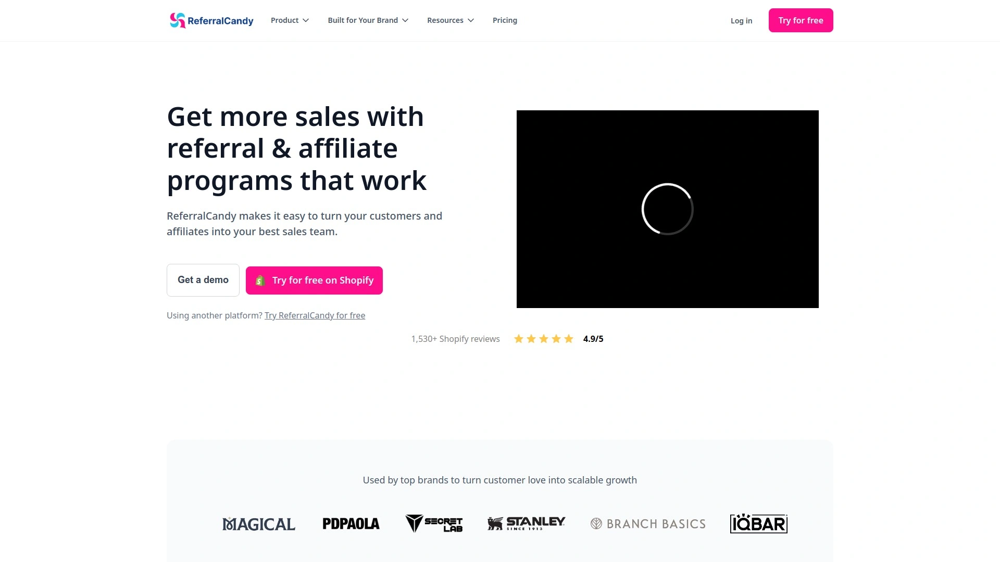
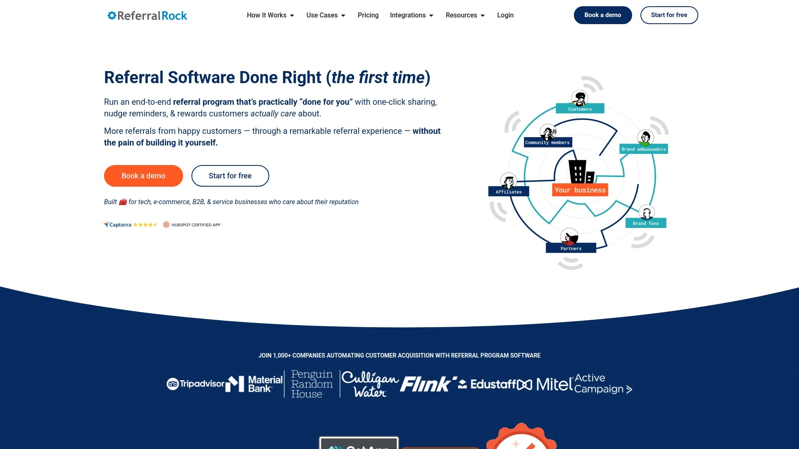
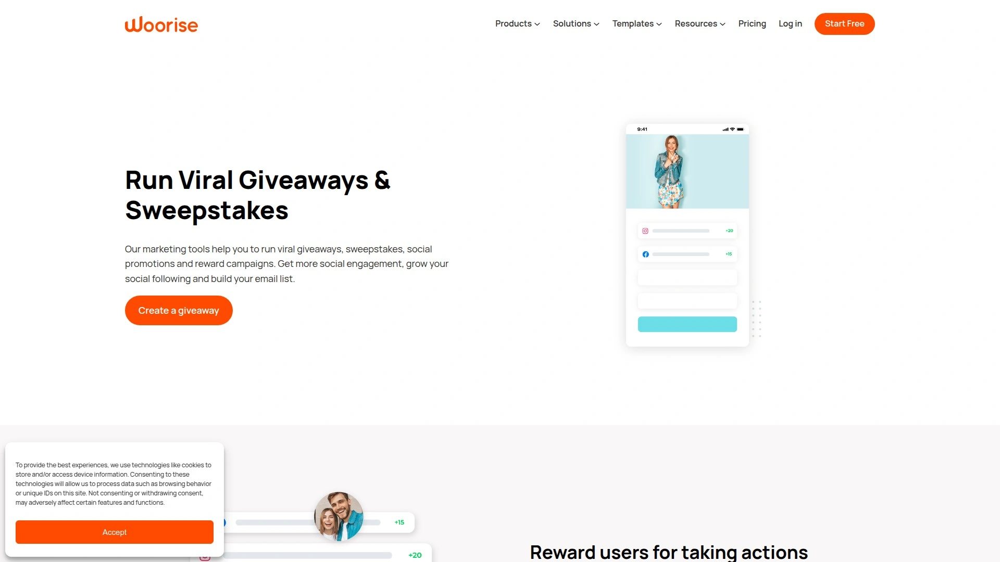
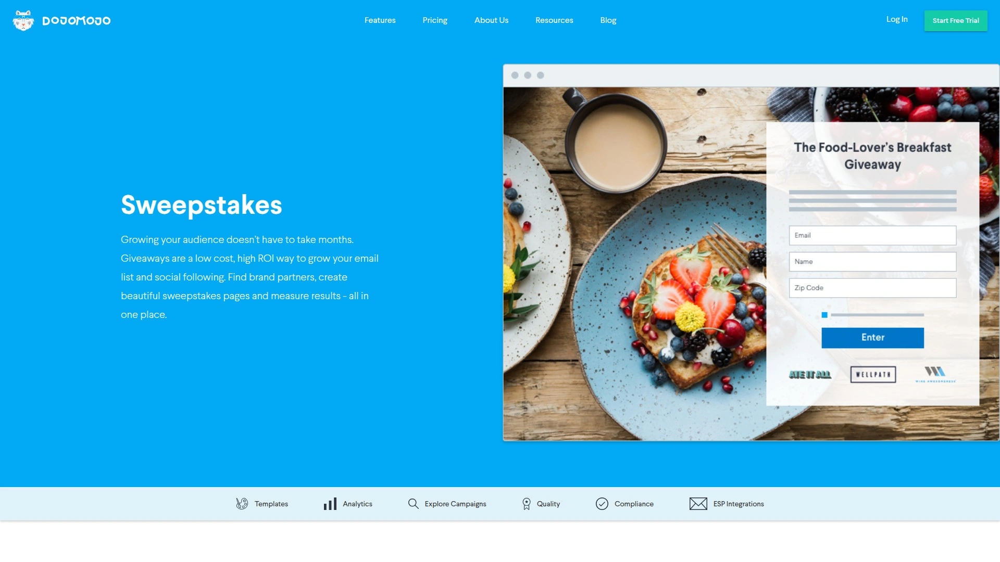
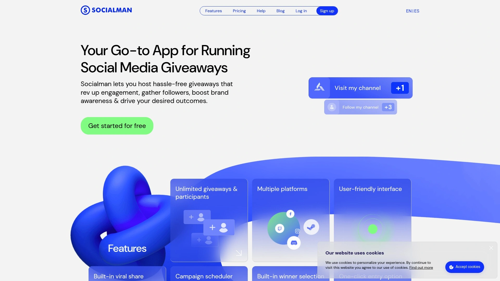

# 2025年二十大最佳抽奖活动与推荐增长工具

想用**抽奖工具**迅速拉新、涨粉、沉淀私域？本篇从海量产品中甄选出 20 款“抽奖/赠品 + 推荐裂变”增长工具，覆盖多平台、多场景。围绕**社交裂变、推荐营销、自动化防刷**等关键能力，帮助你在可控成本下实现更稳、更快的增长闭环。

无论你是电商转化、品牌种草，还是应用冷启动、活动拉新，都能找到契合的解决方案与落地路径。

---

## **[VYPER](https://vyper.io)**
一站式抽奖裂变引擎，十分钟上线活动。

- 支持“抽奖、排行榜、积分任务”等多玩法，模板丰富，上手快；可自定义品牌域名与追踪像素，便于数据归因与再营销。
- 适合电商拉新、App 等待名单、社媒涨粉；提供可视化编辑与多种嵌入形态（落地页/小部件/内嵌）。

## **[Gleam](https://gleam.io/)**
多应用组合，覆盖抽奖、奖励、UGC、表单。

- 100+ 行动项与平台集成，搭建病毒传播路径；提供反作弊与验证动作。
- 竞赛/抽奖组件适合社媒互动与邮件收集，附成体系运营指南。

## **[ViralSweep](https://www.viralsweep.com/)**
深耕电商场景的抽奖与联名活动平台。

- 原生对接 Shopify/邮件与 CRM，支持“消费即得额外抽奖次数”。
- 提供“即时中奖、UGC 征集、购买返积分”等模块，适合转化驱动。

## **[UpViral](https://www.upviral.com/)**
“抽奖 + 奖励”双引擎，专注推荐裂变。

- 通过积分/排行榜设计驱动分享，带来稳定的“老带新”。
- 适合等候名单、产品发布、活动预热等多场景。

## **[ShortStack](https://www.shortstack.com/)**
企业级互动营销组件库。

- 即时中奖、测验、投票、UGC 征集等模板齐全；支持视频/图像等多媒体投稿。
- 可 24 小时快速搭建并上线活动页，运营友好。

## **[Easypromos](https://www.easypromosapp.com/)**
玩法覆盖全面，法务与合规模块完善。

- 提供“抽奖/即时中奖/社媒评论抽取/测验”等 44+ 类型，支持防刷校验。
- 成本清晰，适合中小品牌做高频轻运营活动。

## **[Wishpond](https://wishpond.com/)**
营销一体化，活动与自动化联动转化。

- 围绕社媒活动提升 ROI，表单/邮件/Nurture 协同，适合线索到成交的全链路。

## **[Viral Loops](https://viral-loops.com/)**
轻松复刻经典“推荐增长”玩法。

- 提供推荐、等候名单、里程碑奖励等模板库，内置积分与反作弊。

## **[RafflePress](https://rafflepress.com/)**
WordPress 生态最强抽奖插件之一。

- 拖拽式搭建、内置“病毒模板”，适合博主/内容站快速涨粉集邮。

## **[KingSumo](https://kingsumo.com/)**
极简玩法，快速起盘的“病毒抽奖”。

- 支持邮件或社媒登录、分享加码，适合个人与小团队。

## **[SweepWidget](https://sweepwidget.com/)**
“90+ 行动项”与多语种支持的高性价比之选。

- 覆盖 30+ 平台、二维码/弹窗/落地页多形态投放，内置反作弊与短信验证等。

## **[KickoffLabs](https://kickofflabs.com/)**
落地页 + 推荐引擎，打造“拉新-分享-回流”闭环。

- 拖拽式页面、积分与奖励、排行榜等组件；AI 助力快速生成活动。

## **[InviteReferrals](https://www.invitereferrals.com/)**
围绕推荐营销的多渠道增长套件。

- 支持站内外触点触发，提供可视化流程与数据分析。

## **[GrowSurf](https://growsurf.com/)**
面向科技与 SaaS 的内嵌式推荐系统。

- 几天内即可上线“朋友推荐”项目，提供实时分析与自动化运营。

## **[ReferralCandy](https://www.referralcandy.com/)**
电商领域的口碑裂变常青树。

- 快速创建推荐计划，内置反作弊、实时营收归因仪表盘。

## **[Referral Rock](https://referralrock.com/)**
面向 B2B/服务业的推荐与合作增长平台。

- 端到端自动化，覆盖追踪、激励与传播触点管理。

## **[Woorise](https://woorise.com/giveaways)**
集“表单/落地页/抽奖”于一体的增长工具。

- 多模板、多渠道投放与合规工具（如活动规则生成器），适合中小团队。

## **[DojoMojo](https://www.dojomojo.com/home/sweepstakes)**
以品牌联名与合作抽奖见长。

- 平台聚合上万品牌，内置找搭子、签协议、合规模板与数据分发能力。

## **[Socialman](https://socialman.net/)**
多平台活动轻量化解决方案。

- 一处创建，多端联动；支持自动选奖与多语言，适合社媒侧拉新。

## **[Votigo](https://www.votigo.com/)**
老牌社会化活动服务商，方案深、覆盖广。

- 提供竞赛/抽奖/UGC/法务合规等一揽子服务，适合品牌级大型活动。

---

## FAQ

**Q1：如何在 1 天内把“抽奖 + 推荐”跑起来？**
选用带模板与反作弊的工具（如 VYPER、Gleam），用“报名页 + 分享任务 + 奖励规则”三步走；素材先行、规则从简，优先打通邮件/CRM。

**Q2：如何评估活动质量而非只看报名量？**
关注“有效分享率、重复参与率、邮件订阅留存、转化贡献（下单/激活）”；选择具备来源归因与黑名单/风控能力的平台（如 ViralSweep、ShortStack）。

**Q3：电商场景更适合哪类工具？**
优先选有电商集成与“消费返积分/条码核销”等能力的产品（如 ViralSweep、ReferralCandy、UpViral），便于从线索直达转化。

---

## 总结
以上 20 款**抽奖活动与推荐增长工具**覆盖从冷启动到增长加速的核心链路。若你希望“低门槛、快上线、强裂变”，**[VYPER 抽奖工具](https://vyper.io)**尤其适合用于“新品等候名单、社媒涨粉、老带新拉新”等高频场景；配合清晰的激励与反作弊，既能稳住成本，也能放大口碑效应。
